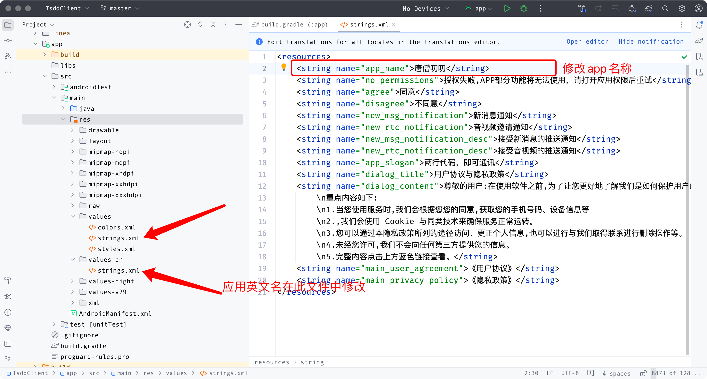
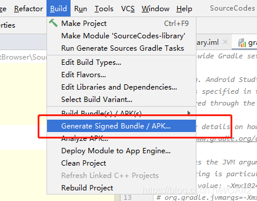
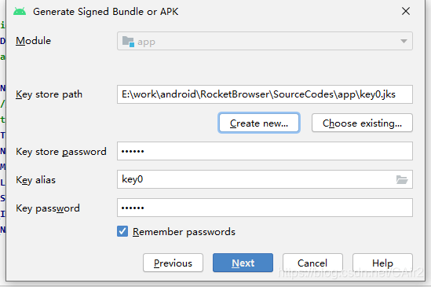
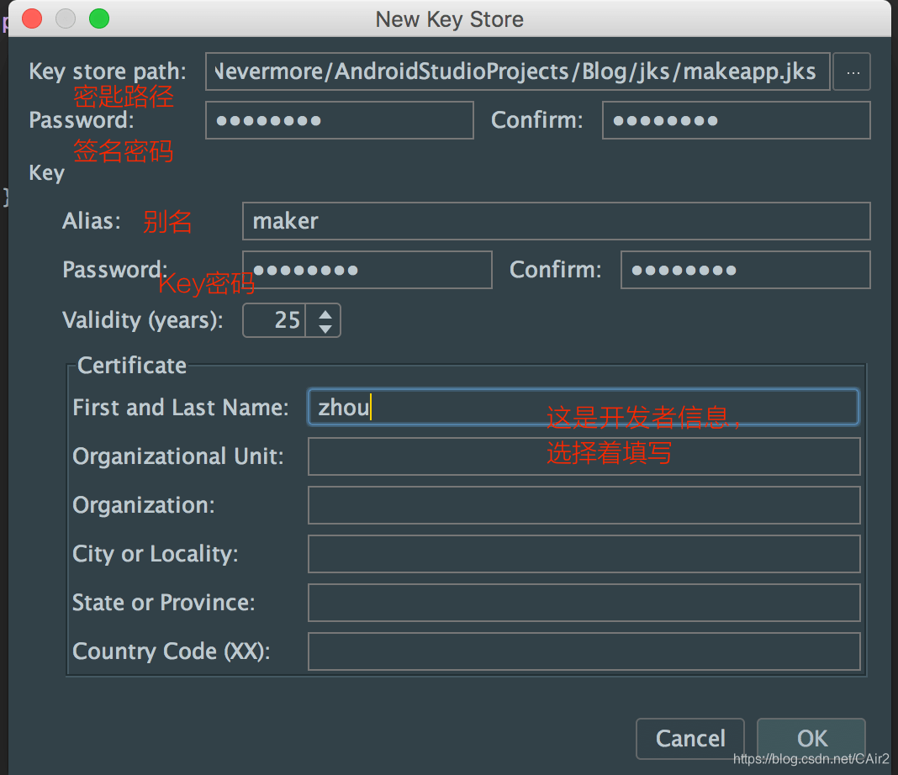
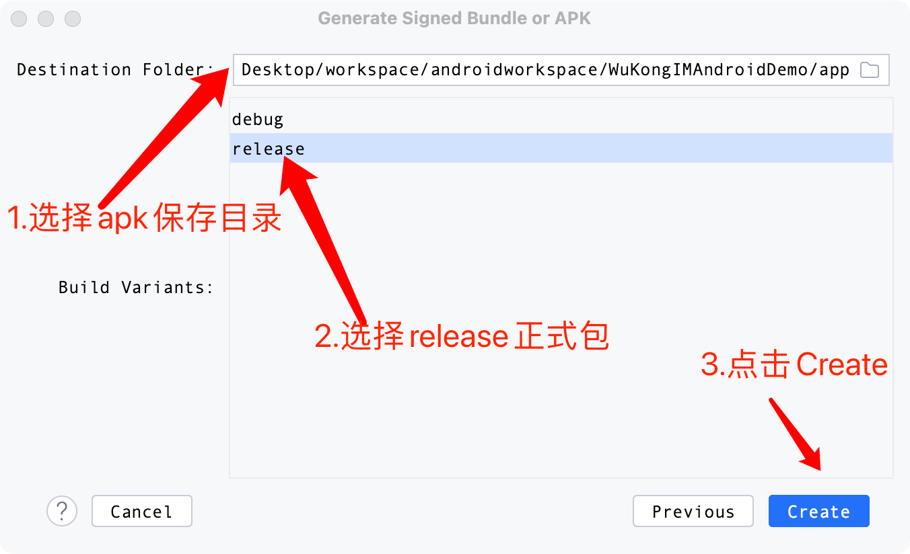
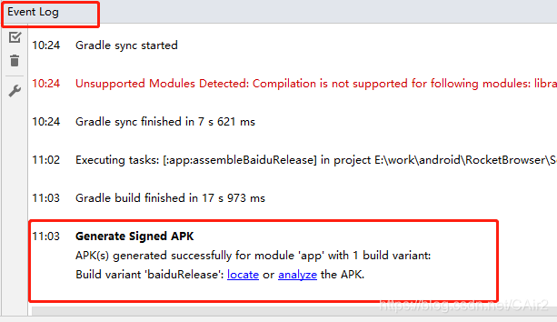

# Android


# 项目编译


### 源码编译
    

```shell
git clone https://github.com/TangSengDaoDao/TangSengDaoDaoAndroid.git

Android studio Open TangSengDaoDaoAndroid 
```

### 修改应用名称
在`app`模块中找到`src`-->`main`-->`res`-->`values`-->`strings.xml`文件，修改name为`app_name`的值。如下图所示



### 修改应用包名
#### 第一步
在`app`模块中右键`java`目录，弹出菜单中依次选择：`Open in`-->`Finder`在系统文件夹中将对应的文件夹目录改成需要设置的包的文件夹目录
#### 第二步

在`app`模块中找到`build.gradle`文件，复制`namespace`对应的包名。选中app模块，右键弹出菜单中选择`Replace in Files`，在弹出框中选中`In Project`选项，并在第一个输入框粘贴复制的`namespace`的包名，第二个输入框输入自己新的包名。然后点击`Replace all`按钮。如图所示


### 修改应用Logo
替换`app`模块中`res`文件夹下名为`ic_logo.png`的图片文件。如下图所示


### 编译打包
在确定程序能正常编译无报错的情况下按以下步骤打包

在as中顶部导航栏点击`Build`-->`Generate Signed Bundle/APK`。

如果已经拥有apk密钥，则选择已经存在的密钥，然后输入密码信息即可，否则创建密钥Create new…。


记得好好保管密钥文件和密码额。以上设置好了就点击Next，

等待打包完成后，此时查看Event Log窗口，查看输出信息，点击locate可以跳转到apk文件位置。

对应的app-release.apk就是生成的正式包