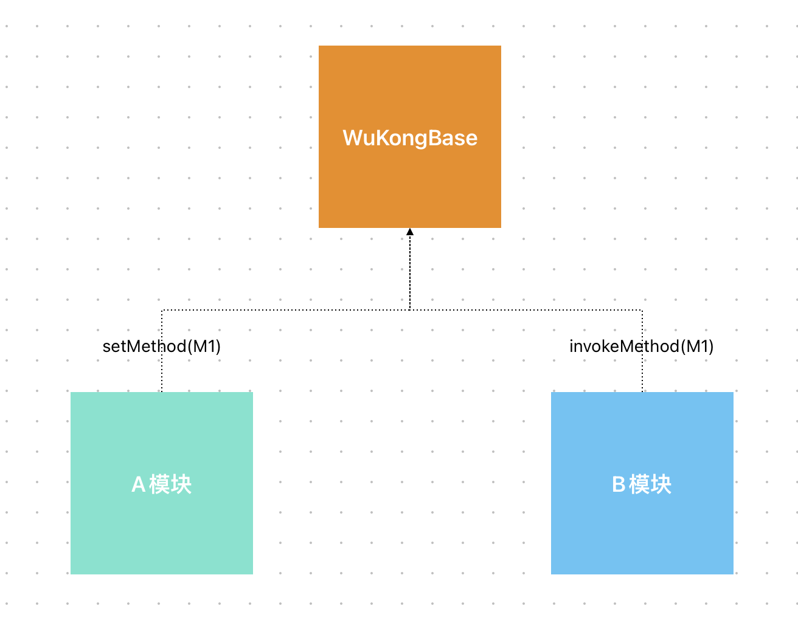

# 模块开发
 为了方便业务开发唐僧叨叨采用了模块开发。不同模块处理独立的业务功能，可以独立使用，也可以组合使用。设计达到的目的就是为了方便在`app`模块通过一句配置就能引入模块。如：`wklogin`模块在主程序的`application` 中注入模块
 ```kotlin
 // 登录模块
 WKLoginApplication.getInstance().init(this)
 ```
如果重写登录模块，只需要新建模块，然后按模块规则实现登录的逻辑，然后注册新写的登录模块就可以了

### 创建模块
#### 第一步

右键项目名-->'New'-->'Module'，然后依次填写模块名称，模块包名等信息。

根据模块业务，在模块中新建入口文件，如文件处理模块可命名`WkFileApplication`并在该文件中编写注册方法。
```kotlin
// 文件管理
class WKFileApplication private constructor() {
    private object SingletonInstance {
        val INSTANCE = WKFileApplication()
    }

    companion object {
        val instance: WKFileApplication
            get() = SingletonInstance.INSTANCE
    }
    // 暴露入口方法
    fun init(context: Context) {
        // todo 其他业务
    }
}
```
#### 第二步
依赖基础模块和`app`模块引入该模块。
在新模块的`build.gradle`文件中添加对`base`模块的依赖
```groovy
// 依赖base模块
api project(':wkbase')
```
在`app`模块中添加对新模块的引入
```groovy
// 添加新模块。
api project(':模块名称')
```
#### 第三步
在主程序的`application` 中注入模块。如模块的application文件名为`WKFileApplication`则注册代码如下
```kotlin
// 注册模块
WKFileApplication.instance.init(this)
```
对此app模块就能访问到新建的模块代码了

如果需要不同模块之间能相互访问页面或数据可查看`模块规则`

### 模块规则
模块有入口文件和对外提供的方法（Method）组合而成。



1、模块A向`base`注册M1方法

2、模块B向`base`获取并调用M1方法

下面通过登录模块(`wklogin`)和通用ui模块(`wkuikit`)举例说明

我们常见的需求在app内点击`退出登录`时，需退出应用回到应用登录页面。由于我们应用首页和登录页面不在同一个模块内，并且相互直接并没有依赖关系，无法直接访问登录页面。这时就需要通过模块规则实现该功能。

在登录模块的入口文件中的init方法添加页面跳转监听

`kotlin`
```kotlin
EndpointManager.getInstance().setMethod(
            "show_login_view"
        ) { `object` ->
            // 跳转到登录页面
            if (`object` is Context) {
                `object`.startActivity(Intent(`object`, LoginActivity::class.java))
            }
            null
        }
```
`java`
```java
EndpointManager.getInstance().setMethod("show_login_view", object -> {
            // 跳转到登录页面
            Intent intent = new Intent((Context)object, LoginActivity.class);
                ((Context)object).startActivity(intent);
            return null;
        });
```
在通用模块点击`退出登录`按钮时跳转到登录页面

`kotlin`
```kotlin
// 显示登录页面
EndpointManager.getInstance().invoke("show_login_view",this)
```
`java`
```java
// 显示登录页面
EndpointManager.getInstance().invoke("show_login_view",this)
```
注意`setMethod`和`invokeMethod`的`sid`必须一致，否则无法实现模块直接的访问。如上面实现的调整到登录页面的sid都为`show_login_view`

### 模块总结
整个过程分为三步

1、新模块需依赖`base`模块
2、新模块编写模块入口文件
3、编写自己的模块方法
