# 宝塔部署

## 安装宝塔

在线安装
::: code-group

```shell [RedHat/CentOS]
yum install -y wget && wget -O install.sh https://download.bt.cn/install/install_6.0.sh && sh install.sh ed8484bec
```

```shell [Ubuntu/Deepin]
wget -O install.sh https://download.bt.cn/install/install-ubuntu_6.0.sh && sudo bash install.sh ed8484bec
```

```shell [Debian]
wget -O install.sh https://download.bt.cn/install/install-ubuntu_6.0.sh && bash install.sh ed8484bec
```

```shell [国产龙芯]
wget -O install_panel.sh https://download.bt.cn/install/0/loongarch64/loongarch64_install_panel.sh && bash install_panel.sh ed8484bec
```

:::
关于宝塔的安装部署与基础功能介绍，请参考[宝塔官方文档](https://www.bt.cn/new/index.html)。在完成了宝塔的安装部署后，根据提示网址打开浏览器进入 宝塔，如下界面。
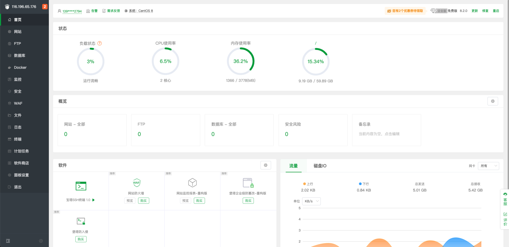

## 安装运行环境

安装 docker 和或 docker-compose

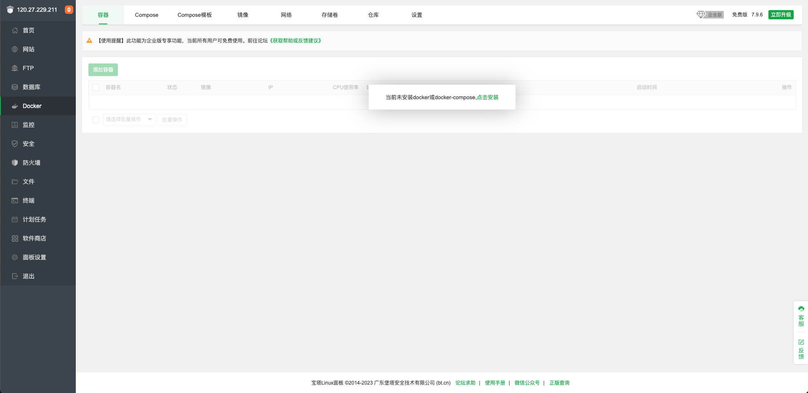

## 添加TSDaoDao Compose模版

1. 在`/home`目录新建文件`tsdd`
   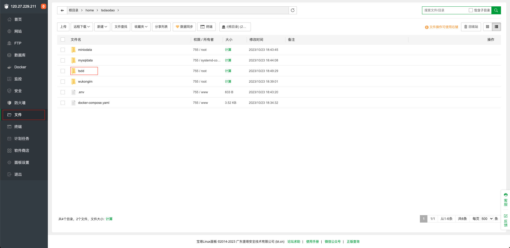

2. 在`/home/tsdd`目录新建`docker-compose.yaml`

```yaml
version: "3.1"
services:
  wukongim: # 唐僧叨叨通讯服务（悟空IM）
    image: registry.cn-shanghai.aliyuncs.com/wukongim/wukongim:latest
    restart: always
    ports:
      # - "5001:5001" # http api端口（业务端调用，仅限内网开放）
      - "5100:5100" # tcp长连接端口（外网开放）
      - "5200:5200" # websocket端口（外网开放）
      - "5300:5300" # 监控端口
    volumes:
      - ./wukongim:/root/wukongim
    environment:
      - WK_MODE=${WK_MODE}
      - WK_EXTERNAL_IP=${EXTERNAL_IP}
      - WK_CONVERSATION_ON=true
      - WK_WEBHOOK_GRPCADDR=tangsengdaodaoserver:6979
      - WK_DATASOURCE_ADDR=http://tangsengdaodaoserver:8090/v1/datasource
      - WK_DATASOURCE_CHANNELINFOON=true
      - WK_TOKENAUTHON=true
  tangsengdaodaoserver: # 唐僧叨叨的业务服务
    image: registry.cn-shanghai.aliyuncs.com/wukongim/tangsengdaodaoserver:latest
    restart: always
    command: "api"
    healthcheck:
      test: "wget -q -Y off -O /dev/null http://localhost:8090/v1/ping > /dev/null 2>&1"
      interval: 10s
      timeout: 10s
      retries: 3
    depends_on:
      - redis
      - mysql
      - wukongim
    ports:
      - "8090:8090"
    volumes:
      - ./tsdd:/home/tsdddata
      # - ./tsdd/configs/tsdd.yaml:/home/configs/tsdd.yaml
    environment:
      - TS_MODE=${TS_MODE}
      - TS_WUKONGIM_APIURL=http://wukongim:5001
      - TS_DB_MYSQLADDR=root:${MYSQL_ROOT_PASSWORD}@tcp(mysql)/${MYSQL_DATABASE}?charset=utf8mb4&parseTime=true&loc=Local
      - TS_DB_REDISADDR=redis:6379
      - TS_EXTERNAL_IP=${EXTERNAL_IP}
      - TS_SMSCODE=${TS_SMSCODE}
      - TS_FILESERVICE=${TS_FILESERVICE}
      - TS_MINIO_ACCESSKEYID=${MINIO_ROOT_USER}
      - TS_MINIO_SECRETACCESSKEY=${MINIO_ROOT_PASSWORD}
      - TS_AVATAR_DEFAULTBASEURL=https://api.multiavatar.com/{avatar}.png
      - TS_ADMINPWD=${TS_ADMINPWD}
  tangsengdaodaoweb: # 唐僧叨叨的web服务
    image: registry.cn-shanghai.aliyuncs.com/wukongim/tangsengdaodaoweb:latest
    restart: always
    environment:
      - API_URL=http://${EXTERNAL_IP}:8090/
    ports:
      - "82:80"
  tangsengdaodaomanager: # 唐僧叨叨的后台管理系统
    image: registry.cn-shanghai.aliyuncs.com/wukongim/tangsengdaodaomanager:latest
    restart: always
    environment:
      - API_URL=http://${EXTERNAL_IP}:8090/
    ports:
      - "83:80"
  minio: # minio文件管理服务
    image: minio/minio:latest # use a remote image
    expose:
      - "9000"
      - "9001"
    command: "server /data --console-address ':9001'"
    ports:
      - "9000:9000"
      - "9001:9001"
    environment:
      - MINIO_ROOT_USER=${MINIO_ROOT_USER}
      - MINIO_ROOT_PASSWORD=${MINIO_ROOT_PASSWORD}
    healthcheck:
      test: ["CMD", "curl", "-f", "http://localhost:9000/minio/health/live"]
      interval: 30s
      timeout: 20s
      retries: 3
    volumes:
      - ./miniodata:/data
  mysql: # mysql数据库
    image: mysql:latest
    command: --default-authentication-plugin=mysql_native_password
    healthcheck:
      test: ["CMD", "mysqladmin", "ping", "-h", "localhost"]
    environment:
      - TZ=Asia/Shanghai
      - MYSQL_ROOT_PASSWORD=${MYSQL_ROOT_PASSWORD}
      - MYSQL_DATABASE=${MYSQL_DATABASE}
    volumes:
      - ./mysqldata:/var/lib/mysql
  redis: # redis
    image: redis
    restart: always
    healthcheck:
      test: ["CMD", "redis-cli", "ping"]
      interval: 1s
      timeout: 3s
      retries: 30
  adminer: # mysql web管理工具 调试用，为了安全生产不要打开
    image: adminer:latest
    ports:
      - 8306:8080
```
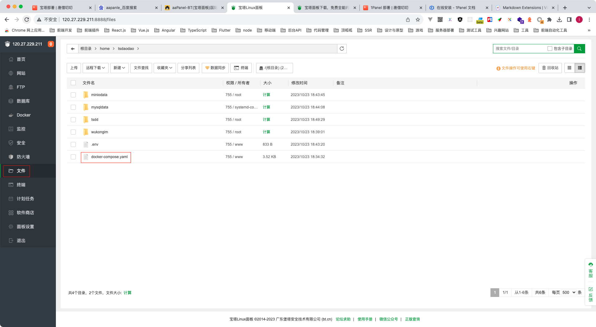

3. 在`/home/tsdd`目录新建`.env`

``` shell
# Common config

# The IP address of the server.
EXTERNAL_IP=

# MYSQL Config

 # The password of the root user of the mysql database
MYSQL_ROOT_PASSWORD=
# The name of the mysql database
MYSQL_DATABASE=im

# Minio Config

# The access key ID of the minio file service
MINIO_ROOT_USER=minio
# The secret access key of the minio file service
MINIO_ROOT_PASSWORD=

# WuKongIM Config

# debug or release
WK_MODE=debug

# TangSengDaoDao Config

# File service type, default is minio
TS_FILESERVICE=minio
# debug or release
TS_MODE=debug
# The SMS code for testing, if it is not empty, the SMS code will be this value (If you need to configure real SMS, please refer to the SMS configuration in the complete configuration)
TS_SMSCODE=123456

# superAdmin password
TS_ADMINPWD=
```
::: tip env文件内，必须修改的参数
- EXTERNAL_IP：服务器的对外IP地址
- MYSQL_ROOT_PASSWORD：mysql数据库的root用户密码，可随机填写
- MINIO_ROOT_PASSWORD：minio 文件服务的密码，可随机填写(至少8位)
- TS_SMSCODE：手机注册默认的短信验证码，默认值`123456`
- TS_ADMINPWD：唐僧叨叨后台管理系统的管理员密码,用户名为 `superAdmin`，可随机填写(至少8位)
:::
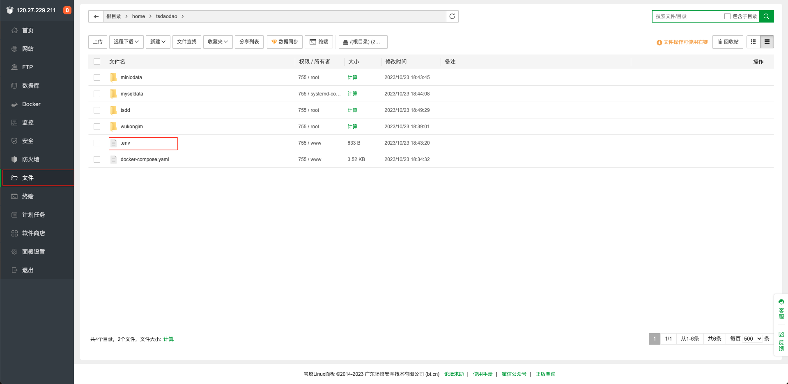

4. 添加`tsdaodao` Compose 模版


## 安装 TSDaoDao
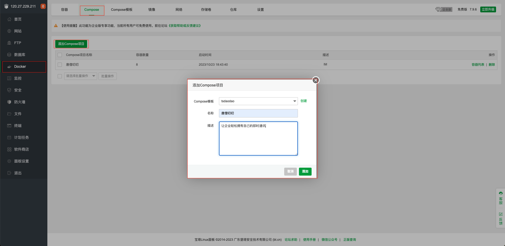

## 访问 TSDaoDao

### 查看运行成功
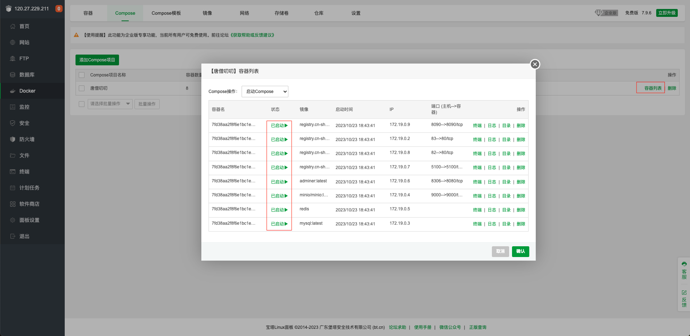

### 访问悟空IM监控

::: tip 提醒
* 在浏览器访问地址：http:// IP + : +悟空IM监控端口 + /web
* 悟空IM监控端口：默认端口5300
:::


### 访问唐僧叨叨管理后台

::: tip 提醒
* 在浏览器访问地址：http:// IP + : + 唐僧叨叨管理后台端口
* 唐僧叨叨管理后台端口：默认端口83
:::

1. 登录界面

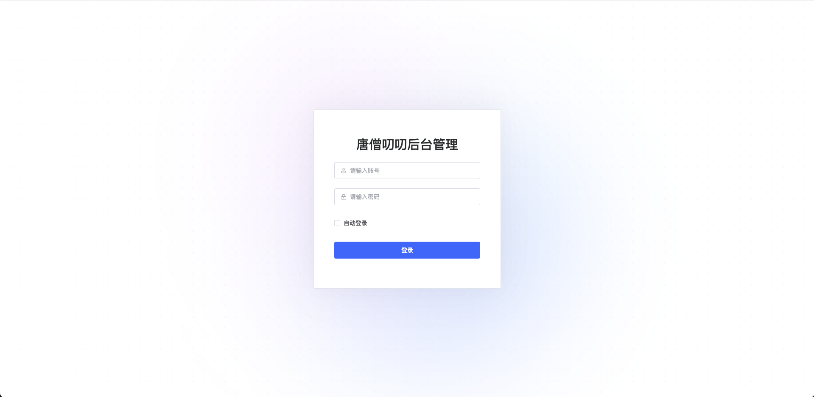

2. 查看超级管理员帐号并进行登录

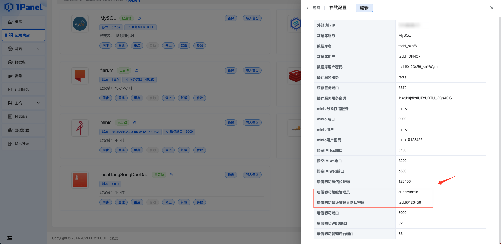

3. 登录成功


### 访问唐僧叨叨WEB端口

::: tip 提醒
* 在浏览器访问地址：http:// IP + : + 唐僧叨叨WEB端口
* 唐僧叨叨WEB端口：默认端口83
:::

1. 登录界面

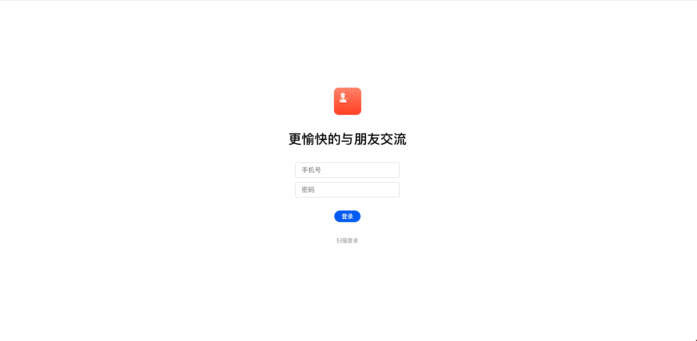

2. 登录成功

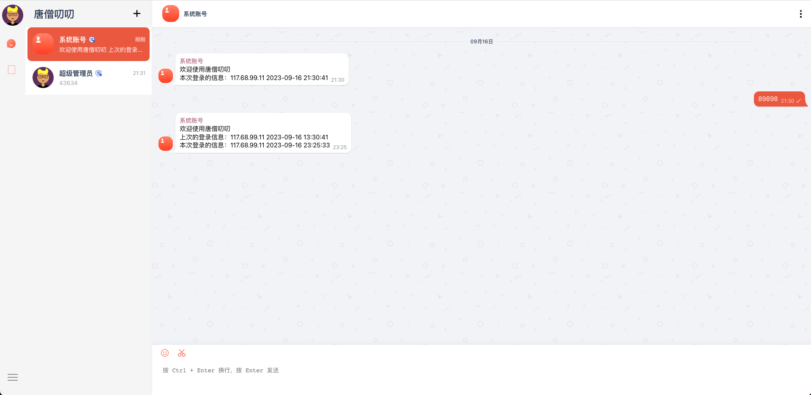
